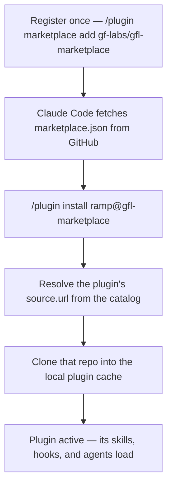

<p align="center">
  <picture>
    <source media="(prefers-color-scheme: dark)" srcset="docs/assets/lockup-dark.png">
    
  </picture>
</p>

<h1 align="center">gfl-marketplace</h1>

<p align="center"><em>The Greenfield Labs plugin marketplace for Claude Code — one place to install, update, and share the tools that make a team productive.</em></p>

<p align="center">
  <a href="https://github.com/gf-labs/gfl-marketplace/actions/workflows/validate.yml"></a>
  <a href="./LICENSE"></a>
  
  
</p>

<p align="center">Built by <a href="https://github.com/berniegreen">Bernie Green</a> · <a href="https://github.com/gf-labs">Greenfield Labs</a></p>

---

## Why this exists

Claude Code's power comes from its extension points — slash commands, hooks, subagents, MCP servers. But a clever command sitting in one developer's `~/.claude/` only becomes a *team* capability when there's a way to distribute it: install it the same way everywhere, update it in one step, and trust that everyone is running the same version.

That distribution channel is a **marketplace**. `gfl-marketplace` is the Greenfield Labs catalog — a single source you register once, after which every GFL plugin is one command away.

### What a Claude Code marketplace actually is

- **What** — a small manifest (`marketplace.json`) that lists plugins and where to fetch each one. No plugin code lives here; it's a pure catalog.
- **Why** — so a whole team installs, pins, and updates plugins consistently instead of copying files by hand.
- **How** — you register the marketplace once, then `/plugin install <name>@gfl-marketplace`. On install, Claude Code clones each plugin's source repo into its local cache.



---

## The plugins

| Plugin | Install | What it does |
|--------|---------|--------------|
| **[`ramp`](https://github.com/gf-labs/ramp)** | `/plugin install ramp@gfl-marketplace` | Adaptive, repo-grounded learning mode — knowledge graphs, spaced repetition, and a passive skill observer. Built for onboarding engineers to Claude Code and your codebase. |
| **[`tools`](https://github.com/gf-labs/claude-toolbox)** | `/plugin install tools@gfl-marketplace` | Session lifecycle management — orient, checkpoint, close out, and archive. Keeps context clean and the thread unbroken across sessions. (Repo: `claude-toolbox`.) |

---

## Install

Register the marketplace once, then install whatever you need:

```text
/plugin marketplace add gf-labs/gfl-marketplace
/plugin install ramp@gfl-marketplace
/plugin install tools@gfl-marketplace
```

Prefer a declarative, version-controlled setup? Merge this into `~/.claude/settings.json` instead (add the key alongside any you already have):

```json
"extraKnownMarketplaces": {
  "gfl-marketplace": {
    "source": { "source": "github", "repo": "gf-labs/gfl-marketplace" }
  }
}
```

No local clone needed — Claude Code fetches the catalog from GitHub. Refresh it any time with `/plugin marketplace update gfl-marketplace`.

> Some plugins have their own prerequisites — `tools`, for example, needs a `CLAUDE_TOOLBOX_ROOT` environment variable set (a local clone plus one line in `settings.json`) before its commands will run — see [its README](https://github.com/gf-labs/claude-toolbox). Each plugin's own README covers its specifics.

---

## Troubleshooting

| Symptom | Likely cause | Fix |
|---------|--------------|-----|
| `/plugin install` fails with `could not read Username` or a clone/auth error | The plugin's source repo is private, or git has no GitHub HTTPS credential | The source repo must be public or you must have access to it. If your `gh` is SSH-only, run `gh auth setup-git` so git can clone over HTTPS with your token. |
| A plugin's code change isn't showing up | Installs are cached by version | Bump the plugin's `version` in its `plugin.json`, push, then reinstall. `/reload-plugins` only picks up minor in-session edits — it won't pull new code from GitHub. |
| The catalog looks stale — e.g. a newly added plugin is missing | Your local copy of the marketplace is cached | Refresh it with `/plugin marketplace update gfl-marketplace`. |
| `/tools:*` commands error or do nothing right after install | `tools` needs its `CLAUDE_TOOLBOX_ROOT` environment variable set | Follow the one-time setup in [`claude-toolbox`](https://github.com/gf-labs/claude-toolbox)'s README — a local clone plus one line in `settings.json`. |

---

## Contributing a plugin

Adding a plugin to the catalog is a four-step change to one file:

1. Make sure the plugin repo has a valid `.claude-plugin/plugin.json`.
2. Push it to GitHub.
3. Add an entry to [`.claude-plugin/marketplace.json`](.claude-plugin/marketplace.json) with the repo's HTTPS `.git` URL.
4. `/plugin install your-plugin@gfl-marketplace`.

A catalog entry looks like this:

```json
{
  "name": "your-plugin",
  "description": "One line on what it does",
  "source": { "source": "url", "url": "https://github.com/gf-labs/your-plugin.git" },
  "category": "productivity",
  "author": { "name": "Your Name" }
}
```

**House conventions** — a deliberately strict subset of what the [official schema](https://github.com/anthropics/claude-plugins-official) allows, enforced on every change by [`scripts/validate-marketplace.py`](scripts/validate-marketplace.py) in CI so the catalog and these docs can't drift:

- **`$schema` present.** The official schema treats it as optional (Claude Code ignores it at load time); we require it so editors get autocomplete. The value is an *identifier*, not a fetchable URL — it 404s by design.
- **`description` at the top level.** The schema also accepts it under `metadata` for backward compatibility; we keep it top-level.
- **HTTPS `github.com` `.git` `url` sources.** The schema is broader — it also allows `github` (`owner/repo`), `git-subdir`, and `npm` sources, and `url` accepts SSH and bare URLs — but this catalog standardizes on one form.
- **`sha` (optional) pins a plugin to a commit.** We track each plugin's default branch; add a `sha` for a reproducible, pinned install.

---

## Local development

**Catalog changes are live.** When this repo is registered as a local `directory` source, Claude Code reads `marketplace.json` from disk every session — no push needed for manifest edits to take effect. (When registered as a `github` source, push to GitHub first.)

**Plugin *code* changes use `--plugin-dir`.** To develop a plugin live, bypass the marketplace and load it straight from its repo:

```bash
claude --plugin-dir path/to/ramp            # develop ramp live
claude --plugin-dir path/to/claude-toolbox  # develop tools live
```

To pick up code changes through the *installed* (cached) path, bump the plugin's version in its `plugin.json`, push, and reinstall. `/reload-plugins` reloads active plugins for minor in-session edits but won't pull new code from GitHub — for real plugin work, prefer `--plugin-dir`.

---

## About Greenfield Labs

Greenfield Labs builds developer tooling for Claude Code with a single throughline: **tools should make a team measurably more capable, not just busier.** Both plugins in this catalog are designed to be read as much as run — each one is a worked example of a different slice of Claude Code's extension model, from slash commands and hooks to subagents and MCP servers.

---

## Acknowledgements

Built on [Claude Code](https://claude.com/claude-code) and the [Claude Code plugin system](https://code.claude.com/docs/en/plugins) by Anthropic. The marketplace manifest follows the schema published in [`anthropics/claude-plugins-official`](https://github.com/anthropics/claude-plugins-official).

---

## License

[MIT](./LICENSE) © 2026 Greenfield Labs
